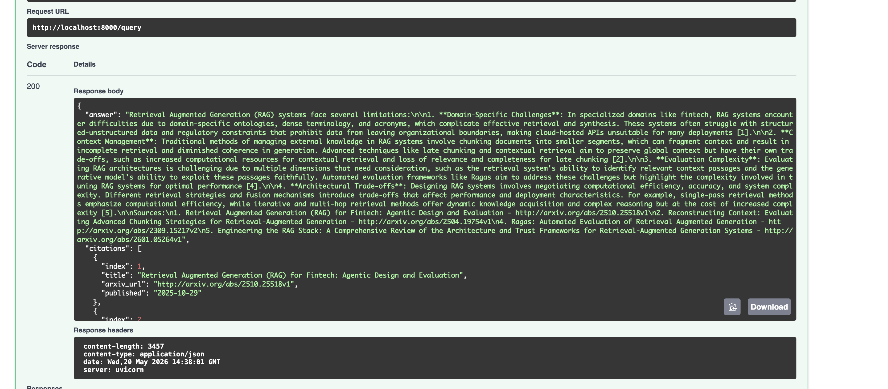

# RAG Portfolio Project — Ask My ArXiv Docs


## Demo



> Asking "limitations of retrieval augmented generation systems" returns
> a cited answer grounded in 4 real ArXiv papers.

A production-grade Retrieval-Augmented Generation (RAG) system that lets you
query a corpus of ArXiv AI/ML papers with cited, grounded answers.

## Features

- **Hybrid retrieval** — BM25 keyword search + vector similarity, fused with Reciprocal Rank Fusion (RRF)
- **Cross-encoder reranking** — re-scores top candidates for maximum relevance
- **Citation enforcement** — every answer references the exact paper and chunk it came from
- **FastAPI backend** — clean REST endpoint ready for a frontend or Streamlit UI
- **CI-gated eval pipeline** — RAGAs metrics run on every PR via GitHub Actions

## Project Structure

```
rag-portfolio/
├── ingestion/          # Download ArXiv PDFs, chunk, embed
├── retrieval/          # BM25, vector, and hybrid retrievers
├── reranking/          # Cross-encoder reranker
├── generation/         # Prompt builder + LLM client
├── api/                # FastAPI app
├── eval/               # RAGAs evaluation + golden dataset
└── .github/workflows/  # CI pipeline
```

## Quickstart

```bash
# 1. Clone and set up environment
git clone <your-repo-url>
cd rag-portfolio
python -m venv .venv
source .venv/bin/activate   # Windows: .venv\Scripts\activate
pip install -r requirements.txt

# 2. Add your API keys
cp .env.example .env
# Edit .env and add your OpenAI or Anthropic key

# 3. Ingest papers (downloads ~50 ArXiv PDFs)
python ingestion/ingest_arxiv.py

# 4. Embed and store in Chroma
python ingestion/embed_corpus.py

# 5. Run the API
uvicorn api.main:app --reload

# 6. (Optional) Chat UI
cd frontend && npm install && npm run dev
# Open http://localhost:5173 — set VITE_API_URL in frontend/.env for deployed API

# 7. Ask a question (curl)
curl -X POST http://localhost:8000/query \
  -H "Content-Type: application/json" \
  -d '{"question": "What are the main failure modes of naive RAG?"}'
```

## Build Order (Weekly Plan)

| Week | Goal | Files |
|------|------|-------|
| 1 | Ingest + embed ArXiv papers | `ingestion/` |
| 2 | Hybrid retrieval (BM25 + vector + RRF) | `retrieval/` |
| 3 | Reranking, citations, FastAPI | `reranking/`, `generation/`, `api/` |
| 4 | Eval pipeline + CI | `eval/`, `.github/` |

## Evaluation

```bash
# Run RAGAs evaluation locally
pytest eval/evaluate.py -v
```

The CI pipeline in `.github/workflows/eval.yml` runs this automatically on every
pull request and blocks merges if faithfulness or context recall drops below the
configured threshold.

## Tech Stack

| Layer | Library |
|-------|---------|
| Embeddings | `sentence-transformers` (BAAI/bge-small-en-v1.5) |
| Vector store | `chromadb` |
| Keyword search | `rank-bm25` |
| Reranker | `cross-encoder/ms-marco-MiniLM-L-6-v2` |
| LLM | OpenAI GPT-4o or Anthropic Claude |
| API | `fastapi` + `uvicorn` |
| Evaluation | `ragas` + `pytest` |
| CI | GitHub Actions |
