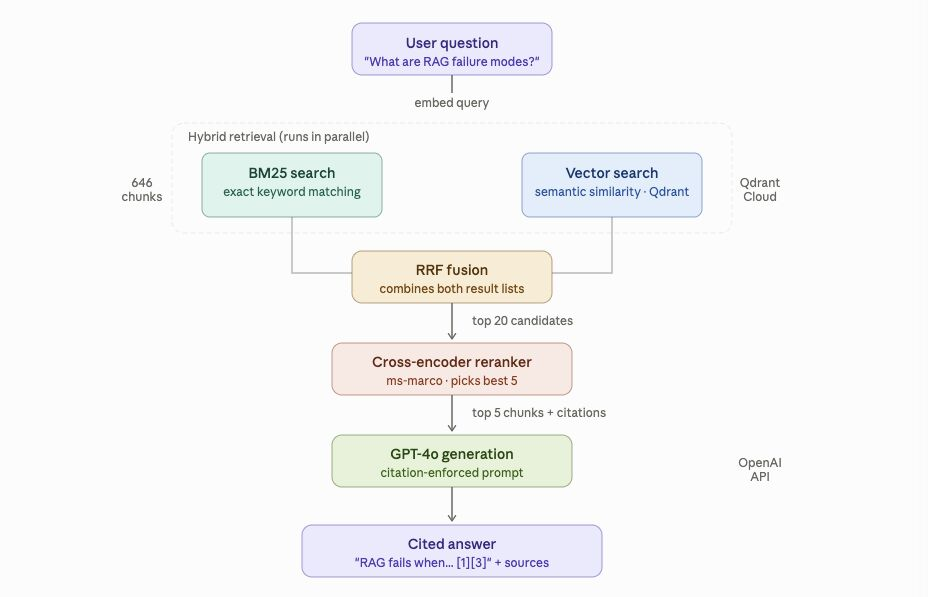

# Production RAG Pipeline — ArXiv Research Assistant


A production-grade Retrieval-Augmented Generation system that answers natural language questions about AI research papers with fully cited, grounded responses. Built to demonstrate the enterprise RAG pattern used in real-world document intelligence systems.

**[Live demo](https://production-rag-pipeline.vercel.app)** · **[GitHub](https://github.com/LucasLisboaDev/production-RAG-pipeline)**

---

## Pipeline overview



The diagram above shows the full request path: hybrid retrieval over BM25 and dense vectors, cross-encoder reranking, citation-enforced generation, and structured citations returned to the client.

---

## Architecture

### Ingestion pipeline

50 ArXiv PDFs are downloaded programmatically via the `arxiv` Python client, parsed with PyMuPDF, and chunked into **646 overlapping 512-word segments** with full citation metadata preserved per chunk (title, authors, published date, arXiv URL).

### Hybrid retrieval

BM25 keyword search (`rank-bm25`) and dense vector similarity search (`sentence-transformers` **BAAI/bge-small-en-v1.5**, 384-dimensional embeddings) run in parallel. Results are fused using **Reciprocal Rank Fusion (RRF)** — a rank-based fusion algorithm that combines incompatible score scales without normalization.

### Vector store

**Qdrant Cloud** (managed vector database) with cosine similarity. A collection of 646 vectors is persistent and queryable over HTTP from any environment.

### Reranking

`cross-encoder/ms-marco-MiniLM-L-6-v2` re-scores the top 20 hybrid candidates by jointly encoding query + passage pairs, returning the top 5 most relevant chunks. This significantly improves precision over retrieval alone.

### Generation

**GPT-4o** via the OpenAI API (Anthropic Claude is also supported via `LLM_PROVIDER`) with a citation-enforcement system prompt. Every claim in the generated answer must reference a numbered source from the retrieved context. Answers that cannot be grounded in the retrieved chunks are explicitly refused.

### Evaluation

The **RAGAs** framework measures **Faithfulness** (does the answer stay within retrieved context?) and **Context Recall** (did retrieval surface the right information?) against a golden Q&A dataset. Thresholds gate every pull request via GitHub Actions CI — quality regressions block merges automatically.

---

## Stack

| Layer | Technology |
|-------|------------|
| Backend | Python · FastAPI · uvicorn |
| Retrieval | rank-bm25 · sentence-transformers · Qdrant Cloud |
| Reranking | Hugging Face Transformers · cross-encoder/ms-marco-MiniLM-L-6-v2 |
| LLM | OpenAI GPT-4o (optional: Anthropic Claude) |
| Evaluation | RAGAs · pytest · GitHub Actions |
| Frontend | React · Vite · Tailwind CSS |
| Deployment | Railway (backend) · Vercel (frontend) · Qdrant Cloud (vector DB) |

---

## Key engineering decisions

**Hybrid over vector-only** — Pure semantic search misses exact technical terms (model names, dataset names, paper-specific terminology). BM25 catches these precisely. RRF fuses both without requiring score normalization.

**Two-stage retrieval** — Retrieval optimizes for recall (find everything relevant); reranking optimizes for precision (pick the best). Separating these concerns allows each to use the right tool: fast approximate search for recall, slow accurate cross-encoder for precision.

**Citation enforcement over best-effort** — Grounding every claim in a specific retrieved chunk makes answers auditable and reduces hallucination. This is the pattern required for enterprise deployment where answers must be traceable.

**CI-gated evaluation** — Without automated quality measurement, retrieval tuning changes can silently degrade answer quality. RAGAs metrics running on every PR ensure the system never regresses undetected.

---

## Features

- **Hybrid retrieval** — BM25 + dense vectors, fused with RRF
- **Cross-encoder reranking** — re-scores top candidates for maximum relevance
- **Citation enforcement** — every answer references the paper and chunk it came from
- **FastAPI backend** — `POST /query` with structured citations
- **React chat UI** — grounded answers with clickable ArXiv sources
- **CI-gated eval** — RAGAs faithfulness and context recall on every PR

---

## Project structure

```
rag-portfolio/
├── ingestion/          # Download ArXiv PDFs, chunk, embed → Qdrant
├── retrieval/          # BM25, vector, and hybrid retrievers
├── reranking/          # Cross-encoder reranker
├── generation/         # Prompt builder + LLM client
├── api/                # FastAPI app
├── eval/               # RAGAs evaluation + golden dataset
├── frontend/           # React chat UI (Vite)
└── .github/workflows/  # CI pipeline
```

---

## Quickstart

### Prerequisites

- Python 3.11+
- Node.js 18+ (for the frontend)
- [OpenAI API key](https://platform.openai.com/)
- [Qdrant Cloud](https://cloud.qdrant.io/) cluster URL and API key

### Backend

```bash
git clone https://github.com/LucasLisboaDev/production-RAG-pipeline.git
cd production-RAG-pipeline

python -m venv .venv
source .venv/bin/activate   # Windows: .venv\Scripts\activate
pip install -r requirements.txt

cp .env.example .env
# Set OPENAI_API_KEY, QDRANT_URL, QDRANT_API_KEY, LLM_PROVIDER=openai

# Optional: rebuild corpus from ArXiv (~50 papers)
python ingestion/ingest_arxiv.py

# Embed corpus and upload vectors to Qdrant Cloud
python ingestion/embed_corpus.py

uvicorn api.main:app --reload
```

### Frontend

```bash
cd frontend
npm install
cp .env.example .env
# Set VITE_API_URL to your API (default http://localhost:8000 for local dev)
npm run dev
```

Open [http://localhost:5173](http://localhost:5173).

### Example request

```bash
curl -X POST http://localhost:8000/query \
  -H "Content-Type: application/json" \
  -d '{"question": "What are the main failure modes of naive RAG?"}'
```

---

## Evaluation

Run RAGAs evaluation locally (requires `OPENAI_API_KEY`, Qdrant credentials, and vectors uploaded):

```bash
pytest eval/evaluate.py -v
```

| Metric | Threshold |
|--------|-----------|
| Faithfulness | ≥ 0.60 |
| Context recall | ≥ 0.60 |

The workflow in [`.github/workflows/eval.yml`](.github/workflows/eval.yml) runs on every pull request to `main`: re-embeds the corpus to Qdrant, evaluates against [`eval/golden_dataset.json`](eval/golden_dataset.json), and fails the build if metrics drop below threshold.

---

## Environment variables

| Variable | Description |
|----------|-------------|
| `OPENAI_API_KEY` | OpenAI API key (generation + RAGAs eval) |
| `ANTHROPIC_API_KEY` | Optional; used when `LLM_PROVIDER=anthropic` |
| `LLM_PROVIDER` | `openai` or `anthropic` |
| `QDRANT_URL` | Qdrant cluster URL (e.g. `https://….cloud.qdrant.io`) |
| `QDRANT_API_KEY` | Qdrant API key |
| `VITE_API_URL` | Frontend: backend base URL (no trailing slash) |

See [`.env.example`](.env.example) and [`frontend/.env.example`](frontend/.env.example).

---

## API

| Method | Path | Description |
|--------|------|-------------|
| `GET` | `/health` | Health check; reports whether `data/corpus.json` is present |
| `POST` | `/query` | Body: `{"question": "...", "top_k": 5}` → answer + citations |

Interactive docs: [http://localhost:8000/docs](http://localhost:8000/docs) when running locally.

---

## License

Portfolio / demonstration project. See repository for license details if applicable.
